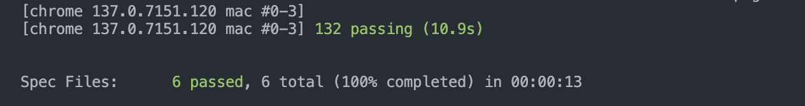

# The internet is broken

We're trying to test https://the-internet.herokuapp.com/ but, it's going horribly. Goodness gracious, barely any tests are green. Please help us by doing the following:

1. Unzip this repo.
2. Create a new GitHub repo.
3. Push this repo in its broken state to your new repo.
4. Fix as much as you can.
5. Make any changes you feel would make this better.
6. Make a PR against the original.
7. Send us the PR link for review.

## Node JS

The recommended node version is v20.19.3 or v18.20.8
We recommend using nvm to install and manage node versions. It can be found at https://github.com/nvm-sh/nvm.

## Running Tests

Run tests with `npm run wdio` or `npm run wdio-headless`

Run specific tests with `npm run wdio -- --cucumberOpts.tagExpression="@TAG"`

#### You are our only hope.

### My solutions as the only hope
 - basic_auth step-definition:
    page prompts an un targetable sign in from the browswer that doesn't present in the DOM. Therefore, the foo-bar creds would not work at all since we can not access the "Not authorized" status without targeting the browser sign-in page. My solution to api test with axios. foo-bar pair now prompts 401 and returns the "Not authorized" status
 - checkboxes step-definition:
    the original selector was using nth-child which didn't work because the checkboxes weren't direct children. I fixed it by using nth-of-type to target the correct checkbox elements. Also, checkbox 2 starts checked by default, so clicking it would uncheck it. I added logic to check if the checkbox is already selected before clicking, ensuring both checkboxes end up in a checked state for the test to pass.
 - dropdown step-definition:
    I double-checked the dropdown test logic to ensure it was working correctly and not just by coincidence. After analyzing the HTML structure and JavaScript implementation, I confirmed the test is working properly. The JavaScript correctly manages the 'selected' attribute by removing it from all options and setting it on the chosen option based on its value. The test implementation correctly reads the selected option text using the 'selected' attribute, making this a reliable approach for testing dropdown functionality. The feature file was also updated to follow the same syntax and architecture as the other feature files
 - index step-definition:
    I noticed the original regex approach was overly complex and failing. Looking at the commented-out code in the step definition, I saw there was already a simpler solution using `$("h3")` selector and `toHaveTextContaining()`. I uncommented this approach and it worked perfectly. The regex was trying to match `/h3` (literal forward slash) instead of `<h3>` (HTML tags), which was causing the pattern matching to fail. The simpler approach of directly checking the h3 element text is much more reliable.
 - page object mapping:
    I discovered a case sensitivity issue in the page object mappings. The "Inputs" page was mapped as "inputs" (lowercase) in the paths object, but the test was looking for "Inputs" (capital I). This caused the navigation to fail with a "undefined" href error. I fixed this by updating the mapping to use the correct capitalization that matches the test expectations.
- input POM:
    The inputs.page.js was incorrectly named as DropDown. I renamed it accurately to match InputPage
- input step-definition:
    Changed the XPath to be more reliable with a CSS selector that directly targets the number input

